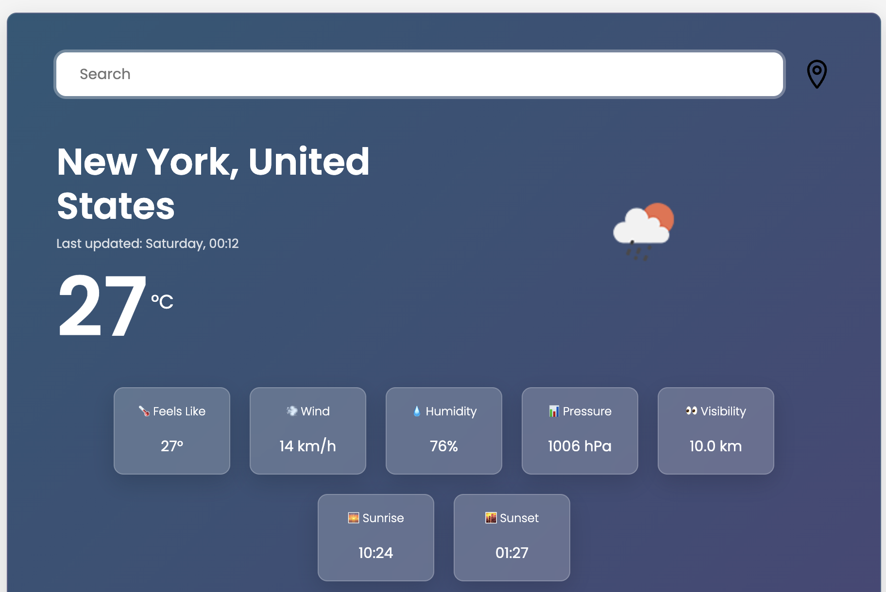
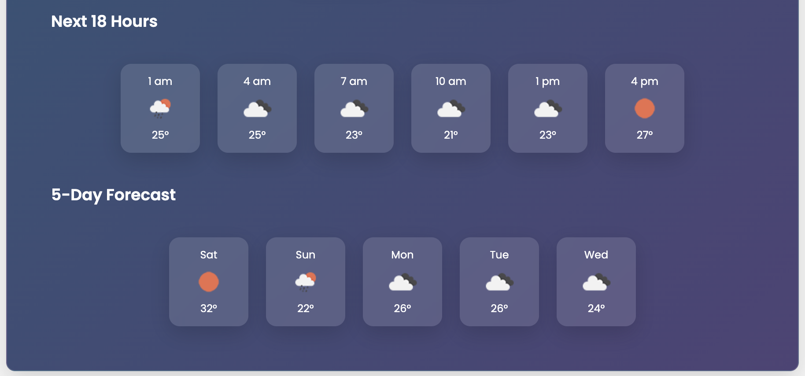

<<<<<<< HEAD
# Weather Dashboard

A modern weather application built with HTML, CSS, and JavaScript that provides real-time weather information and forecasts for cities around the world using the OpenWeather API.

## Features

- Search for weather information by city name
- Live search with automatic weather updates
- Current weather conditions
- 18-hour forecast
- 5-day weather forecast
- Current location weather using the Geolocation API
- Dynamic backgrounds based on weather conditions
- Sunrise and sunset times
- Feels-like temperature
- Wind speed, humidity, pressure, and visibility
- Responsive design for desktop and mobile devices
- Loading states and error handling

## Technologies

- HTML5
- CSS3
- JavaScript (ES6)
- Bootstrap 5
- Axios
- OpenWeather API

## Project Structure

```text
Weather-App/
│
├── index.html
├── README.md
│
├── screenshots/
│
└── src/
    ├── app.js
    └── style.css
```

## Installation

### Clone the Repository

```bash
git clone https://github.com/Salmah1/API-Weather-App.git
cd API-Weather-App
```

### OpenWeather API Setup

This project uses the OpenWeather API to retrieve weather data.

1. Create a free account at https://openweathermap.org
2. Generate an API key from your OpenWeather dashboard
3. Open `src/app.js`
4. Replace the API key value with your own:

```javascript
const API_KEY = "YOUR_API_KEY";
```

> **Note:** Newly generated API keys may take a few minutes to become active.

### Run the Application

Open `index.html` in your preferred web browser.

## How to Use

1. Type a city name into the search bar.
2. Wait for the live search to automatically retrieve weather data.
3. View the current weather conditions.
4. Check the next 18-hour forecast.
5. Review the 5-day forecast.
6. Click the location button to view weather information for your current location.

## API

This project uses the OpenWeather API:

https://openweathermap.org/api

## Screenshots

### Current Weather



### Forecast


=======
# Weather Application 


### Link

https://superlative-pika-b1ebf1.netlify.app

### Description

This is a weather application interface. It allows the user to search for a city, and displays the current weather conditions for that city, along with hourly and weekly forecasts. It also displays the air conditions, including wind and humidity. The app is responsive and works well on different screen sizes.

The code uses Bootstrap framework for styling and Axios library for making HTTP requests to retrieve weather data from OpenWeather API.
>>>>>>> 6bf91efa12cc0146ea6f2ff53f4143654fda4439
